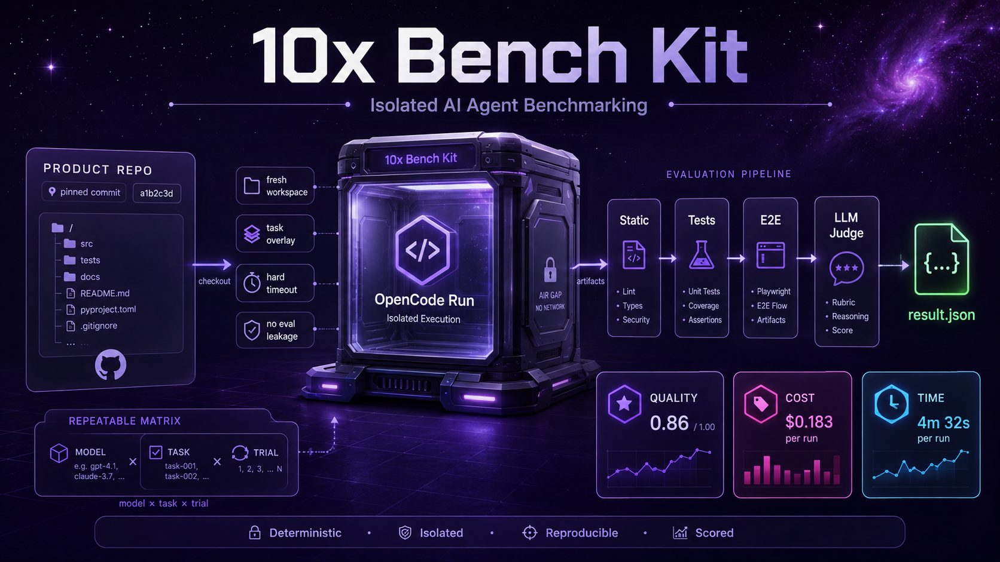

# 10x-bench-kit

Template repo wewnętrznego benchmarku agentów AI. Z tego repo powstaje
**instancja benchmarku** firmy przy pomocy [10xCLI](https://github.com/przeprogramowani/10x-cli)
(`10x bench-kit init`) — osobne repo, które trzyma zadania, pulę ocen
i konfigurację, i uruchamia próby agentów na repozytoriach produktowych
firmy w pełnej izolacji.

Harness na start: **OpenCode** (wyłącznie). Mierzone: jakość (ocena
automatyczna + LLM-as-judge), koszt i czas wykonania.

## Trzy składowe

Struktura repo dzieli się na składowe o różnych właścicielach i różnym
zachowaniu przy `10x bench-kit update`:

| Strefa | Właściciel | Przy `update` |
|---|---|---|
| `.bench-kit/` | kit (my) | podmiana w całości (atomowa) |
| `.agents/skills/` | współdzielona | propozycja diffu — firma decyduje |
| `tasks/`, `evaluation-pool/`, `bench.config.yaml` | firma | nietykalne |

Szczegóły kontraktu każdej strefy — w README danej strefy.

## Quickstart (instancja)

1. `10x bench-kit init <katalog>` — materializuje template, robi świeży
   `git init`, zapisuje wersję w manifeście instancji.
2. Wiring sekretów: klucze API ocenianych modeli, klucz modelu-sędziego,
   token read-only do repozytoriów bazowych.
3. Customizacja przez skille (rozmowa z agentem): obraz pod stack firmy,
   wypełnienie `evaluation-pool/`, kalibracja rubryk, pierwsze zadania.
4. `bench validate` — bramka przed pierwszym runem.
5. Run: `workflow_dispatch` w GH Actions (`models`, `tasks`, `trials`).

## Cykl życia próby

Jedna próba = jeden job macierzy **model × zadanie × próba** w jednorazowym
kontenerze:

1. **Workspace** — świeża kopia repo bazowego na pinowanym commicie +
   overlay zadania; pusty `XDG_DATA_HOME`; zero materiałów oceny.
2. **Wykonanie** — `opencode run` nieinteraktywnie z `prompt.md`, pod
   twardym timeoutem.
3. **Metryki** — adapter czyta storage OpenCode → `metrics.json`; diff
   workspace → `patch.diff`.
4. **Ocena** — bez agenta, dopiero teraz montowane asercje z puli:
   static → tests → e2e → LLM-as-judge; wynik = ważona suma wg `task.yaml`.
5. **Artefakt** — `result.json` ze stemplami wersji (era porównywalności).

## Wersjonowanie i „ery"

Każdy wynik jest stemplowany wersją template'u, hashem katalogu zadania,
modelem sędziego i wersją rubryki. Wyniki porównują się tylko w obrębie ery;
release'y oznaczone w [CHANGELOG.md](CHANGELOG.md) jako `scoring-breaking`
zamykają erę.

Pełny dokument koncepcyjny: DESIGN benchmarku (repo wewnętrzne).
